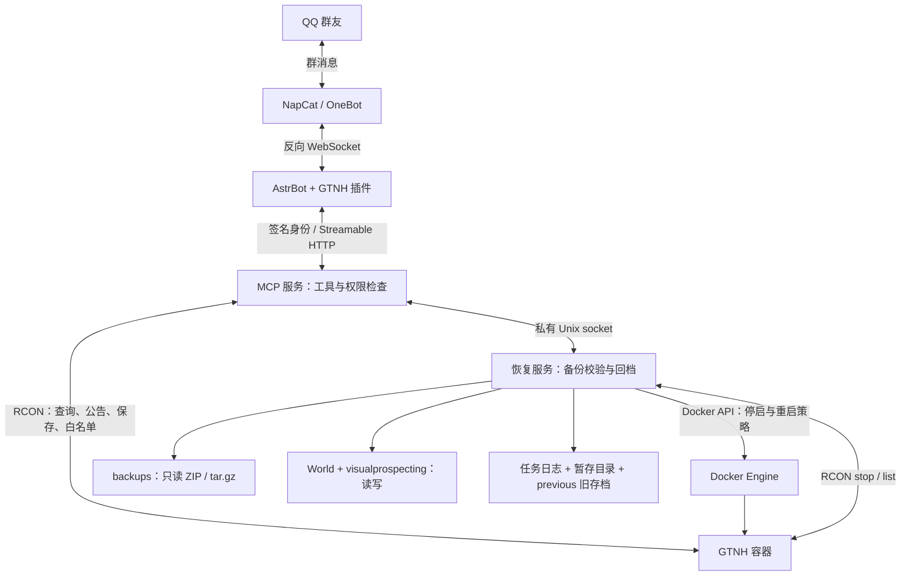

# GTNH MCP

让 AstrBot 群聊通过经过身份校验的 MCP 工具执行 GTNH 日常运维，并由管理员确认后恢复备份。

支持在线玩家、公告、保存世界、白名单管理、备份查询、恢复申请与进度查询。恢复支持 `backups/*.zip` 和 `*.tar.gz`，处理 `WORLD_DIRECTORY`（默认 `World`）和 `visualprospecting`，保留旧存档并支持失败回滚。

**回档后反悔也可以撤销：** 管理员查询成功任务编号，让机器人“撤销这次回档”，再发送新的 `/gtnh_confirm <撤销任务编号>`。程序恢复那次回档前的完整存档，并保留撤销前的当前世界；不会合并两段游戏进度。撤销本身也是恢复任务，成功后仍可再次撤销，详见 [撤销流程](docs/restore.md#撤销已经完成的回档)。

使用 FastMCP Streamable HTTP，默认地址 `http://127.0.0.1:8000/mcp`。MCP 和 AstrBot 使用 Linux Docker host 网络；恢复服务独立持有 Docker 控制权限，通过私有 Unix socket 接受请求。

## 运行架构



插件从真实群消息取得用户和群身份并签名，MCP 按配置检查群和管理员权限；身份不由模型填写。回档须由原申请人在原群发送 `/gtnh_confirm <任务编号>` 确认，不能让模型代为确认。因此本部署使用配套插件，不再在 AstrBot 原生 MCP 页面重复添加服务。

双服务使用同一项目镜像、不同入口。MCP 以非 root 用户运行，不挂载游戏目录或 Docker socket；恢复服务处理文件与容器操作，不开放 TCP 端口。两者共享操作锁和维护标记，回档期间暂停普通 RCON 工具。任务日志持久化在状态卷中，旧世界保存在服务端 `.gtnh-restore/<任务编号>/previous/`。运行时不依赖 SSH。

NAS 已只读确认 `/volume2/sharev9/minecraft/gtnh` 下为 `World`、`visualprospecting` 和 `backups`；抽查的日期命名 ZIP 索引包含这两个顶层目录，使用 Deflate。程序不依赖日期命名规则，也不会把 `World` 改成 `Worlds`。索引检查不等于完整备份校验或实际恢复验收；`server.properties` 因 SSH 读取权限不足未核实，RCON 仍需部署时确认。

**回档前必须调整 GTNH 启动方式：** 原 `startserver-java9.sh` 的 `while true` 会在 RCON stop 后再次启动 Java。使用 [单次启动脚本](examples/gtnh/startserver-managed.sh)，由 Docker `restart: unless-stopped` 接管自动重启，具体修改和完整部署顺序见下方教程。

## 部署与开发

- [NAS 完整部署：GTNH + MCP + AstrBot + NapCat](docs/deployment.md)
- [全部环境变量与配置参考](docs/configuration.md)
- [架构与模块](docs/architecture.md)
- [身份与工具权限](docs/security.md)
- [恢复流程与人工处理](docs/restore.md)
- [本地验证与 NAS 验收](docs/testing.md)
- [开发约定](AGENTS.md)

本地开发（Windows PowerShell）：

```powershell
uv sync --locked --group dev
uv run pytest
uv run ruff check .
uv run ruff format --check .
```

首次部署请先在隔离 GTNH 测试服使用真实备份验收。`save_world` 只执行保存，不创建备份；本项目读取已有备份，不接管备份生成计划。
