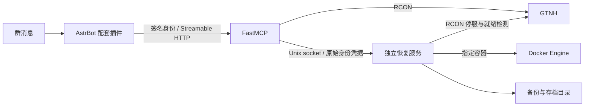

# 架构与模块

## Python 服务

| 模块 | 职责 |
| --- | --- |
| `config` | 环境变量配置、SecretStr、启动校验 |
| `auth` | 60 秒 HS256 身份验证、群白名单、管理员检查 |
| `rcon` | mcrcon 0.7.0 的线程适配、命令参数校验、跨进程操作锁 |
| `server` | FastMCP 工具、每次调用鉴权、私有恢复服务客户端 |
| `backups` | 备份 ID 枚举、SHA-256、归档结构与容量校验、暂存 |
| `container` | 固定 Docker 容器的优雅停服、启动、重启策略与 RCON 就绪检查 |
| `restore` | 持久化确认和任务、单线程恢复执行、目录切换、回滚与中断恢复 |
| `helper` | 私有 Unix socket API、单实例锁、启动恢复及健康检查 |

MCP 服务非 root 运行，不能访问 Docker socket 或存档。恢复服务以 root 运行，只通过固定接口操作配置中的容器和路径，但 Docker socket 本身仍具有高权限。

## 并发与持久化

两服务共享 `/run/gtnh/operations.lock`。RCON 调用取得锁后同步执行；锁繁忙直接拒绝，不排队重试写操作。恢复确认持久化维护标记，后台任务在整个恢复过程持锁。维护标记存在时，普通 RCON 工具全部暂停；备份和任务查询仍可使用。

任务 JSON 位于 `/state`，采用临时文件、fsync 和原子替换。Linux 下同步目录元数据。单实例锁防止多个恢复进程操作同一任务集。运行中服务不应由多个 Compose 项目分别部署，共享锁和状态卷必须保持一致。

HTTP MCP 使用无状态模式。插件每次调用建立独立会话并使用当前事件的身份，避免多人共用一个 MCP 会话串号。长时间运行的恢复任务返回任务编号，查询进度，不占用原始对话连接。

## RCON 适配

上游 mcrcon 的 Linux 超时实现使用 SIGALRM，不能在普通工作线程初始化。`SocketRcon` 继承其命令/上下文管理接口，用 socket 连接超时、总读取期限和有界数据包代替信号，并处理短读取、断连和认证失败。

返回结果保留服务端原始文本，不能仅凭 TCP 调用成功就宣称游戏命令成功。分包响应沿用等待后续可读数据的方式，使用 50ms 间隔；本项目仅暴露响应较短的运维命令。不会自动重发失败命令。
